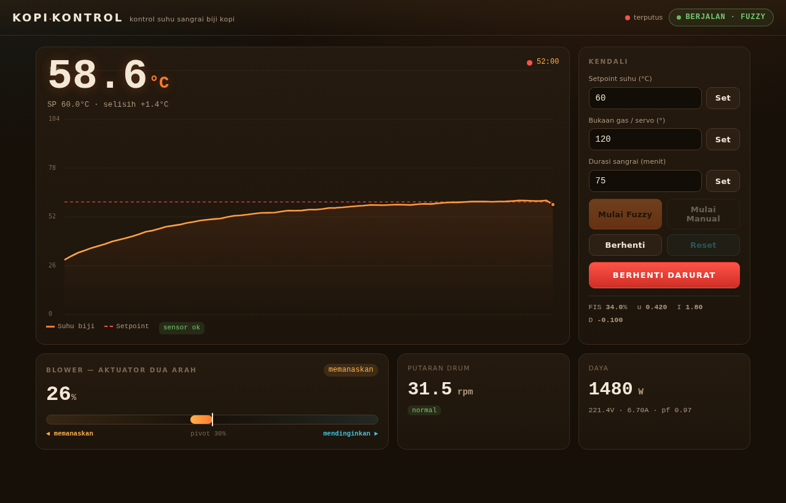
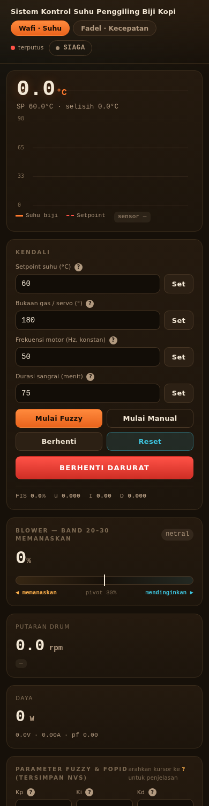
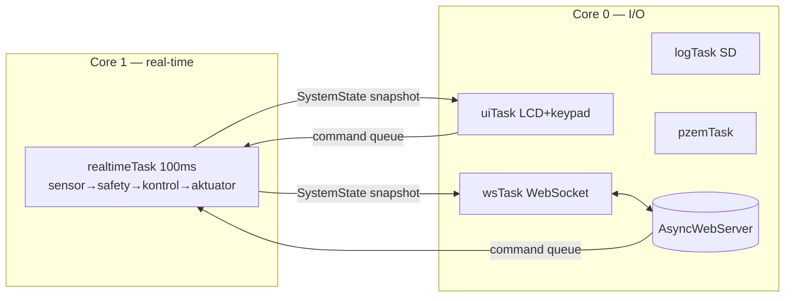
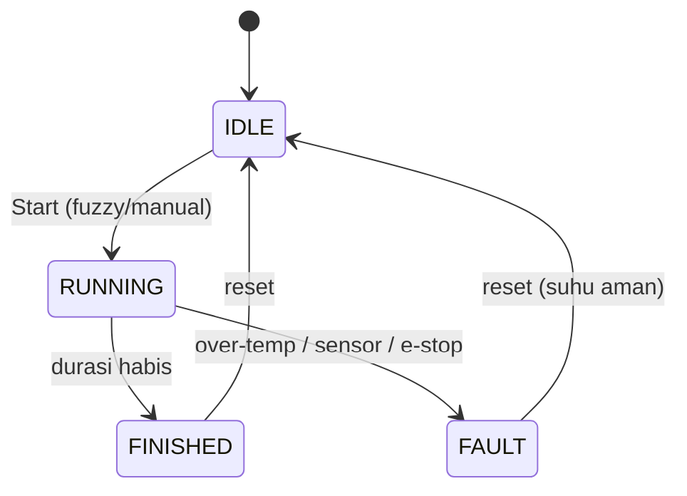

<div align="center">

# ☕ Sistem Penggiling Biji Kopi
### berbasis **Fuzzy** & **PID Order Satu** (FoPID)

Kontrol suhu sangrai presisi di **ESP32** — *Fuzzy Inference System* + *Fractional-Order PID*,
**dual-core FreeRTOS**, dengan dashboard web real-time yang berjalan **100% offline**.




</div>

---

> Mesin pengering/roasting biji kopi. **Sumber panas = burner gas**; **blower (dimmer AC)**
> dikontrol untuk menjaga **suhu** biji pada *setpoint*. Tantangan utamanya: blower bersifat
> **non-monoton** terhadap suhu — itulah inti metode di proyek ini.

## 📑 Daftar Isi
- [Fitur](#-fitur) · [Tampilan](#-tampilan) · [Metode Kontrol](#-metode-kontrol--inti-proyek) · [Arsitektur](#%EF%B8%8F-arsitektur)
- [Hardware](#-hardware--pinout) · [Mulai Cepat](#-mulai-cepat) · [Pemakaian](#%EF%B8%8F-pemakaian) · [Kontrak Web](#-kontrak-web-websocket--rest)
- [Simulasi](#-simulasi) · [Roadmap](#%EF%B8%8F-roadmap) · [Kredit](#-kredit)

## ✨ Fitur

| | |
|---|---|
| 🔥 **Hybrid Fuzzy + FoPID** | Pemetaan error→blower asimetris untuk plant non-monoton |
| 🧵 **Dual-core FreeRTOS** | Kontrol real-time (core 1) terpisah dari web/UI (core 0), non-blocking |
| 🛡️ **Safety supervisor** | Over-temp, sensor gagal, e-stop, auto-stop durasi — selalu jalan |
| 🌐 **Dashboard offline** | Tanpa CDN (Tailwind/Chart.js dibuang) → tetap jalan saat konek ke AP alat |
| 🕹️ **Dua antarmuka** | LCD 20x4 + keypad **dan** web — keduanya lewat *command queue* (anti-konflik) |
| 💾 **Data logger** | CSV ke SD card, unduh via web |
| 🧪 **Simulator** | `tools/control_sim.py` — digital-twin untuk tuning tanpa alat |

## 📸 Tampilan

| Desktop | Mobile |
|:---:|:---:|
|  |  |

## 🧠 Metode Kontrol — *inti proyek*

Blower **tidak** linear terhadap suhu. Hasil karakterisasi alat:

```
 efek ke suhu biji:
   0–10%  → mendinginkan   (aliran kecil, kalor burner tak terbawa)
  20–30%  → MEMANASKAN     (aliran optimal; puncak transfer panas ~25%)
  30–85%  → mendinginkan   (aliran berlebih, kalor terbuang)
```

Karena hubungannya berbentuk **bukit** (puncak ~25%), kontroler dijaga **monoton** dengan
beroperasi di sisi kanan puncak `[25..85]%`: **25% = panas maks · 30% = hold di setpoint · 85% = dingin maks**.

<details>
<summary><b>Rincian Fuzzy + FoPID</b> (klik)</summary>

- **FIS** (`Fis_Header.h`): 5 MF error × 3 MF Δerror → centroid, output di-MF-kan ke `[22..90]%`
  dengan band panas (25–30) sempit & band dingin (30–85) lebar.
- **FoPID** (`control.cpp`): dihitung dalam **°C**, koreksi *dikurangi* dari FIS
  (`BLOWER_IS_COOLER`) → saat dingin blower turun ke ~25 (memanaskan), saat overshoot blower naik (mendinginkan).
- Semua parameter (`Kp Ki Kd λ µ β`, setpoint, durasi, sudut gas) **dapat di-tune** dan
  default-nya di `config.h`.

**Hasil simulasi** (`tools/control_sim.py`):

| Skenario | Hasil |
|---|---|
| 28 → 60 °C | settle **60.0 °C**, blower 30%, overshoot ~0.2 °C |
| di 58 °C (saat naik) | blower **25% → memanaskan** ✅ |
| 70 → 60 °C | blower 69% (dingin) → settle 60.0 |
| Setpoint 75 °C | settle **75.0 °C**, err 0.00 |

</details>

## 🏗️ Arsitektur



Operating state machine:



> Rancangan lengkap: **[ARCHITECTURE.md](ARCHITECTURE.md)**.

## 🔩 Hardware & Pinout

<details>
<summary><b>Daftar komponen & pin</b> (klik)</summary>

| Komponen | Fungsi | Pin ESP32 |
|---|---|---|
| MLX90614 | Sensor suhu IR (I2C) | SDA 21 · SCL 22 |
| DS3231 | RTC (I2C) | SDA 21 · SCL 22 |
| LCD 20x4 (0x27) + Keypad 4x4 (0x20) | Antarmuka lokal | SDA 21 · SCL 22 |
| Dimmer AC (RBDdimmer) | Blower | gate 32 · zero-cross 35 |
| Servo MG996R | Katup gas | 13 |
| Encoder 500 PPR | RPM drum | A 25 · B 33 |
| PZEM-004T | Power meter (UART) | RX 16 · TX 17 |
| SD Card (SPI) | Data logger | CS 5 · SCK 18 · MISO 19 · MOSI 23 |
| LED indikator | Status | 12 |

</details>

## 🚀 Mulai Cepat

<details>
<summary><b>Build & flash dengan arduino-cli</b> (klik)</summary>

```bash
# 1. Core ESP32 (sekali saja)
arduino-cli core install esp32:esp32

# 2. Library
arduino-cli lib install "Adafruit MLX90614 Library" "RTClib" "PZEM004Tv30" \
  "ESP32Servo" "LiquidCrystal I2C" "ArduinoJson" "I2CKeyPad" \
  "AsyncTCP" "ESPAsyncWebServer"
# RBDdimmer (dari GitHub) — patch core 3.x: esp_intr.h→esp_intr_alloc.h, API timer baru
arduino-cli lib install --git-url https://github.com/RobotDynOfficial/RBDDimmer.git

# 3. Kredensial WiFi
cp ESP32_Firmware/secrets.h.example ESP32_Firmware/secrets.h   # lalu isi SSID/PASS

# 4. Compile & upload
arduino-cli compile --fqbn esp32:esp32:esp32 ESP32_Firmware
arduino-cli upload -p /dev/ttyUSB0 --fqbn esp32:esp32:esp32 ESP32_Firmware

# 5. Upload web (LittleFS) — folder ESP32_Firmware/data → partisi LittleFS
```

> Buka dashboard di **`http://kopi.local`** atau IP ESP32 (atau konek ke AP `Kopi-Control`).

</details>

## 🕹️ Pemakaian

- **Keypad:** `A/B` navigasi · `C` pilih/ubah · `D` kembali · `*` STOP (di monitor).
- **Web:** atur setpoint / sudut gas / durasi → **Mulai Fuzzy** atau **Mulai Manual** → pantau kurva.
- **Darurat:** tombol **BERHENTI DARURAT** (web) → gas tutup + blower mati.

## 🌐 Kontrak Web (WebSocket & REST)

<details>
<summary><b>Pesan & endpoint</b> (klik)</summary>

**WebSocket `/ws`** (server→klien, 500 ms): `temp, setpoint, error, blower, servo, rpm, power, fault, opState, …`
**Perintah** (klien→server): `{start:'FUZZY'|'MANUAL'}` · `{stop}` · `{estop}` · `{reset}` · `{setpoint}` · `{servo}` · `{blower}` · `{duration}`

| REST | Fungsi |
|---|---|
| `GET /api/status` | snapshot JSON |
| `GET /api/logs` | daftar CSV |
| `GET /api/download?file=` | unduh CSV |

</details>

## 🧪 Simulasi

```bash
python3 tools/control_sim.py
```
Digital-twin kontroler (FIS+FoPID identik firmware) + model plant. Pakai untuk menalakan
parameter & memverifikasi respons sebelum ke alat.

## 🗺️ Roadmap

- [x] Refactor modular + dual-core FreeRTOS + safety supervisor
- [x] Metode kontrol blower non-monoton (fuzzy + FoPID) + simulator
- [x] Dashboard offline + responsif
- [x] Sinkronisasi input web (load sekali, tak menimpa saat mengetik)
- [x] Data logger 5 dtk + tab grafik (skala sepanjang durasi, t₀, metrik rise/overshoot/osilasi, download CSV/JPG)
- [x] Tuning parameter fuzzy/PID dari web + simpan ke NVS (Preferences)
- [x] **Tab Wafi** — kontrol suhu (+ input freq motor; gas & kecepatan konstan)
- [x] **Tab Fadel** — kontrol kecepatan: PID VFD via **Modbus RTU** ([panduan](VFD_Modbus_ESP32_MAX485.md)), EMA filter encoder

> Rencana detail & keputusan desain: **[REWORK_PLAN.md](REWORK_PLAN.md)**.

## 👥 Kredit

| Peran | Fokus |
|---|---|
| **Wafi** | Kontrol **suhu** (fuzzy + FoPID pada blower) |
| **Fadel** | Kontrol **kecepatan** motor (PID + VFD Modbus RTU) |

## 📄 Lisensi

MIT
