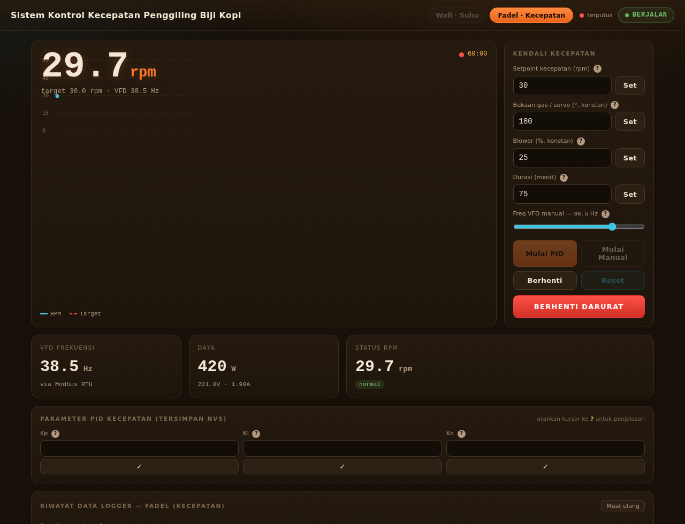
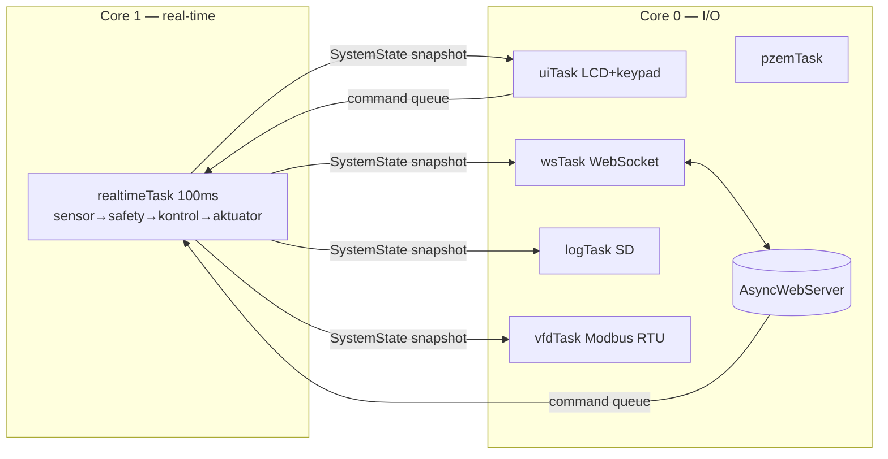
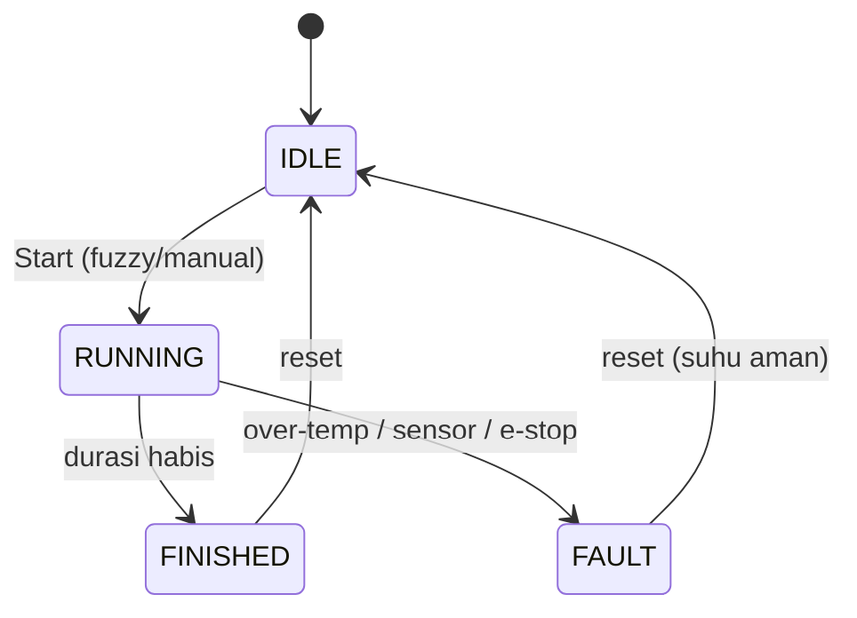

<div align="center">

# ☕ Sistem Penggiling Biji Kopi
### berbasis **Fuzzy** & **PID Order Satu** (FoPID)

Kontrol suhu sangrai presisi di **ESP32** — *Fuzzy Inference System* + *Fractional-Order PID*,
**dual-core FreeRTOS**, dengan dashboard web real-time yang berjalan **100% offline**.


</div>

---

> Mesin pengering/roasting biji kopi. **Sumber panas = burner gas**; **blower (dimmer AC)**
> dikontrol untuk menjaga **suhu** biji pada *setpoint*. Tantangan utamanya: blower bersifat
> **non-monoton** terhadap suhu — itulah inti metode di proyek ini.

## 📑 Daftar Isi
- [Fitur](#-fitur) · [Tampilan](#-tampilan) · [Metode Kontrol](#-metode-kontrol--inti-proyek) · [Parameter & Rumus](#-parameter-tuning--rumus) · [Arsitektur](#%EF%B8%8F-arsitektur)
- [Struktur Proyek](#%EF%B8%8F-struktur-proyek) · [Referensi Teknis](#-referensi-teknis) · [Hardware](#-hardware--pinout) · [Mulai Cepat](#-mulai-cepat)
- [**Manual Book**](#-manual-book--panduan-operasi) · [Kontrak Web](#-kontrak-web-websocket--rest) · [Simulasi](#-simulasi) · [Roadmap](#%EF%B8%8F-roadmap) · [Kredit](#-kredit)

## ✨ Fitur

| | |
|---|---|
| 🔥 **Hybrid Fuzzy + FoPID** | Profil **Wafi**: pemetaan error→blower asimetris untuk plant suhu non-monoton |
| ⚙️ **PID kecepatan → VFD** | Profil **Fadel**: PID RPM → frekuensi VFD via **Modbus RTU**, filter EMA encoder |
| 🧵 **Dual-core FreeRTOS** | Kontrol real-time (core 1) terpisah dari web/UI (core 0), non-blocking |
| 🛡️ **Safety supervisor** | Over-temp, sensor gagal, e-stop, auto-stop durasi — selalu jalan |
| 🌐 **Dashboard offline** | 2 tab (Wafi/Fadel), tanpa CDN → tetap jalan saat konek ke AP alat |
| 🕹️ **LCD + Keypad penuh** | Semua fungsi & parameter bisa dari keypad, **sinkron** dgn web (*last control wins*) |
| 🔄 **Sinkron profil 2 arah** | Ganti profil di web ↔ keypad saling mengikuti |
| 💾 **Data logger + grafik** | Rekam 5 dtk ke SD per-profil, grafik riwayat + metrik, unduh CSV/JPG |
| ❓ **Tuning + tooltip** | Semua parameter tunable & persist NVS; tiap parameter ada penjelasan **?** |
| 🧪 **Simulator** | `tools/control_sim.py` — digital-twin untuk tuning tanpa alat |

## 📸 Tampilan

| Tab Wafi — Suhu | Tab Fadel — Kecepatan | Mobile |
|:---:|:---:|:---:|
|  |  |  |

## 🧠 Metode Kontrol — *inti proyek*

Blower (dimmer AC) **tidak** linear terhadap suhu. Hasil karakterisasi alat:

```
 efek blower ke suhu biji:
   0–10%  → mendinginkan   (aliran kecil, kalor burner tak terbawa)
  20–30%  → MEMANASKAN     (aliran optimal; puncak transfer panas ~25%)
  30–85%+ → mendinginkan   (aliran berlebih, kalor terbuang)
```

Karena hubungan ini berbentuk **bukit**, kurva kontrol dibuat **asimetris** terhadap setpoint
(`SP`), dengan error `e = SP − T`:

| Kondisi suhu | Blower | Maksud |
|---|---|---|
| Jauh di bawah SP (`e` besar +) | **~30 %** | memanaskan lembut |
| Mendekati SP dari bawah | turun ke **~20 %** | memanaskan kuat — *"makin kecil makin panas"* |
| Dalam **±1 % SP** | **0 %** (mati) | deadband — target tercapai |
| Di atas SP (`e` negatif) | **60–100 %** | mendinginkan — makin jauh makin besar |

Verifikasi statik (`tools/control_sim.py`, T → blower): `27→27.8%` · `40→29.4%` · `55→19.5%`
· `59.5→0%` · `62→60.2%` · `80→100%`. Step 27→60 °C: **rise 1.23 mnt · overshoot ≈0 % · osilasi 0.5 %**.

> Detail lengkap rumus & arti tiap parameter ada di bagian
> **[Parameter Tuning & Rumus](#-parameter-tuning--rumus)** di bawah.

## 🎛️ Parameter Tuning & Rumus

Semua parameter di bawah **dapat diubah dari web** (tab Wafi/Fadel), **tersimpan ke NVS**
(Preferences) dan **dimuat saat boot**. Default ada di [`config.h`](ESP32_Firmware/config.h).
Di dashboard, tiap parameter punya tombol **?** berisi ringkasan ini.

### ☕ Wafi — Kontrol Suhu (Fuzzy + FoPID)

Dihitung dalam **°C** tiap `CONTROL_PERIOD_MS` (500 ms), `dt = 0.5 s`. Sumber: [`control.cpp`](ESP32_Firmware/control.cpp) + [`Fis_Header.h`](ESP32_Firmware/Fis_Header.h).

```
e   = SP − T                         # error suhu (+ = di bawah SP)
Δe  = e[k] − e[k−1]                  # laju perubahan

# Deadband: target tercapai → blower mati
if |e| ≤ 0.01·SP:  blower = 0;  stop

# FoPID fraksional (orde λ, µ)
I  += dt^(λ) · e                     # integral fraksional   (clamp ±60)
D   = dt^(−µ) · Δe                   # derivatif fraksional  (clamp ±40)
u   = Kp·e + Ki·I + Kd·D             # keluaran FoPID        (clamp ±14)

# Kurva fuzzy (FIS centroid, 4 MF error × 3 MF Δe → 10..108)
fis  = FIS(e, Δe)

# Gabung: blower besar = mendinginkan → koreksi DIKURANGI (BLOWER_IS_COOLER)
blower = clamp( fis − β·u , 0 , 100 )
```

> Intuisi tanda: di bawah SP `e>0 → u>0 → −β·u` menurunkan blower menuju band panas (20–30 %);
> saat overshoot `e<0 → u<0` menaikkan blower (mendinginkan). FIS memberi bentuk dasar kurva,
> FoPID hanya **trim halus** di atasnya.

| Param | Peran | Default | Dinaikkan ↑ | Diturunkan ↓ | Saran |
|---|---|---|---|---|---|
| **Kp** | Proporsional — trim ∝ error sekarang | `0.20` | respons agresif & cepat, **rawan overshoot/getar** | halus tapi lambat | 0.10–0.40 |
| **Ki** | Integral — hapus error sisa yang menetap | `0.03` | mantap tepat di SP, **rawan osilasi/overshoot** | sisa selisih bertahan lama | 0.01–0.06 |
| **Kd** | Derivatif — redam laju perubahan/overshoot | `0.05` | lebih teredam, **sensitif noise sensor** | kurang redaman, lebih lincah | 0.00–0.10 |
| **λ** | Orde integral fraksional (0–1) | `0.90` | →1: integral makin "biasa"/kuat | →0: efek makin lembut & bermemori | 0.80–1.00 |
| **µ** | Orde derivatif fraksional (0–1) | `0.92` | →1: derivatif makin "biasa" | →0: redaman makin halus & tahan noise | 0.80–1.00 |
| **β** | Bobot pengaruh FoPID atas kurva fuzzy | `0.50` | koreksi FoPID dominan (responsif, **rawan osilasi**) | makin murni fuzzy (kurva apa adanya) | 0.30–0.70 |

**Variabel proses (Wafi):** `Setpoint` suhu target (°C); `Servo/gas` bukaan katup gas =
sumber panas (0–180°, naik = lebih panas); `Freq motor` kecepatan drum konstan via VFD (Hz);
`Durasi` lama sangrai (habis → stop otomatis).

### ⚙️ Fadel — Kontrol Kecepatan (PID → VFD)

PID klasik *direct-acting*: RPM kurang → frekuensi naik. RPM encoder dihaluskan **EMA**
(`rpm = α·rpm_baru + (1−α)·rpm`, `α = 0.2`). Sumber: [`control_speed.cpp`](ESP32_Firmware/control_speed.cpp).

```
e    = SP_rpm − RPM                  # error kecepatan
I   += e · dt                        # integral (clamp ±300)
D    = (e − e_prev) / dt             # derivatif
u    = Kp·e + Ki·I + Kd·D
freq = clamp( u , 0 , 50 ) Hz  →  VFD via Modbus RTU (FC06 0x2001)
```

| Param | Peran | Default | Dinaikkan ↑ | Diturunkan ↓ | Saran |
|---|---|---|---|---|---|
| **Kp** | Proporsional ∝ selisih RPM | `1.00` | koreksi cepat, **rawan overshoot/getar motor** | halus tapi lambat ke target | 0.5–2.0 |
| **Ki** | Integral — hapus selisih RPM menetap (beban/gesekan) | `0.10` | cepat tepat di target, **rawan osilasi** | sisa selisih bertahan | 0.05–0.30 |
| **Kd** | Derivatif — redam lonjakan RPM | `0.00` | lebih stabil, **sensitif noise encoder** | kurang redaman | 0.00–0.50 |

**Variabel proses (Fadel):** `Setpoint` target RPM drum; `Servo/gas` & `Blower %` dijaga
**konstan** (suhu tak dikontrol di mode ini); `Durasi` lama proses. Tersedia **Mulai Manual** —
mengatur frekuensi VFD langsung (0–50 Hz) tanpa PID, untuk uji/kalibrasi motor.

> **Filter EMA `α`** (di `config.h`, `RPM_EMA_ALPHA`): naik → RPM lebih responsif tapi berisik;
> turun → lebih halus tapi sedikit telat. Default `0.2`.

## 🏗️ Arsitektur



Operating state machine:



> Rancangan lengkap: **[ARCHITECTURE.md](ARCHITECTURE.md)**.

## 🗂️ Struktur Proyek

```
.
├── ESP32_Firmware/              # Firmware ESP32 (Arduino · dual-core FreeRTOS)
│   ├── ESP32_Firmware.ino       # Entry: setup(), task FreeRTOS, state machine, applyCommand()
│   ├── config.h                 # SEMUA konstanta: pin, ambang safety, default, jaringan
│   ├── types.h                  # enum (OpState/Profile/CmdType/ParamId…) + struct SystemState & Command
│   ├── state.cpp / .h           # g_state (sumber kebenaran tunggal), mutex, command queue, makro lock
│   ├── sensors.cpp / .h         # MLX90614 (suhu IR), DS3231 (RTC), encoder RPM + EMA, PZEM-004T
│   ├── actuators.cpp / .h       # Dimmer AC (blower), servo (gas), LED status, safe-state
│   ├── control.cpp / .h         # Wafi: Fuzzy + FoPID → blower (kontrol suhu)
│   ├── Fis_Header.h             # Mesin Fuzzy (MF segitiga, rule-base, defuzzifikasi centroid) — header-only
│   ├── control_speed.cpp / .h   # Fadel: PID kecepatan → frekuensi VFD
│   ├── vfd.cpp / .h             # VFD MCU-T13 via Modbus RTU (MAX485, CRC16, FC03/FC06)
│   ├── safety.cpp / .h          # Supervisor: over-temp, sensor gagal, e-stop, status RPM
│   ├── logging.cpp / .h         # Logger CSV ke SD per-profil + daftar & unduh
│   ├── params.cpp / .h          # Simpan/muat parameter ke NVS (Preferences)
│   ├── ui.cpp / .h              # LCD 20×4 + keypad 4×4 (page-based, profil-aware)
│   ├── webserver.cpp / .h       # AsyncWebServer + WebSocket + REST + serve LittleFS
│   ├── secrets.h.example        # Template kredensial WiFi (salin → secrets.h, di-gitignore)
│   └── data/                    # Aset web (di-flash ke partisi LittleFS)
│       ├── index.html           # Struktur dashboard 2 tab (Wafi/Fadel)
│       ├── app.js               # Logika: WebSocket, chart canvas, kontrol, riwayat, tooltip, sinkron tab
│       └── style.css            # Tema offline “roasted-dark” (tanpa CDN)
├── tools/
│   └── control_sim.py           # Digital-twin (FIS+FoPID+plant) untuk verifikasi & tuning tanpa alat
├── docs/                        # Screenshot dashboard untuk README
├── ARCHITECTURE.md              # Rancangan arsitektur lengkap (task, state, kontrak data)
├── REWORK_PLAN.md               # Rencana & keputusan desain v2 (dua profil)
├── VFD_Modbus_ESP32_MAX485.md   # Panduan wiring & protokol Modbus VFD
└── README.md                    # Dokumen ini
```

> **Prinsip modular:** tiap modul `.cpp/.h` punya satu tanggung jawab; semua menulis/membaca
> `g_state` lewat `state.*` (mutex + command queue), tak ada variabel global liar. Konstanta
> "angka ajaib" terpusat di `config.h`. Lihat **[ARCHITECTURE.md](ARCHITECTURE.md)** untuk detail.

## 🔬 Referensi Teknis

<details>
<summary><b>Task &amp; pembagian core (FreeRTOS)</b> (klik)</summary>

| Task | Core | Prio | Periode | Tugas |
|---|:--:|:--:|:--:|---|
| `realtimeTask` | 1 | 3 | 100 ms | baca suhu → drain command → safety → kontrol → aktuator |
| `vfdTask` | 0 | 1 | 400 ms | kirim run/stop + frekuensi ke VFD (Modbus — sengaja dipisah, latensi tinggi) |
| `uiTask` | 0 | 2 | 80 ms | LCD + keypad (render & input) |
| `wsTask` | 0 | 1 | 500 ms | broadcast telemetri ke semua klien WebSocket |
| `pzemTask` | 0 | 1 | 1000 ms | baca PZEM (V/I/P/pf) |
| `logTask` | 0 | 1 | 5000 ms | tulis 1 baris CSV ke SD (saat merekam) |

`loop()` sengaja idle — semua kerja di task. Hanya `realtimeTask` yang menulis state proses.

</details>

<details>
<summary><b>Peta partisi flash</b> (skema default 4 MB) (klik)</summary>

| Partisi | Offset | Ukuran | Isi |
|---|---|---|---|
| nvs | `0x9000` | 20 KB | parameter tersimpan (Preferences) |
| otadata | `0xe000` | 8 KB | metadata OTA |
| app0 | `0x10000` | 1.25 MB | **firmware** (≈94% terpakai) |
| app1 | `0x150000` | 1.25 MB | slot OTA cadangan |
| spiffs | `0x290000` | 1.375 MB | **LittleFS** — aset web (`data/`) |
| coredump | `0x3F0000` | 64 KB | core dump |

</details>

<details>
<summary><b>Format berkas log CSV</b> (klik)</summary>

Disimpan tiap **5 detik** saat proses berjalan ke `/log/wafi/wafi_NNN.csv` atau
`/log/fadel/fadel_NNN.csv`. Baris pertama `#` = metadata (waktu mulai, SP, Kp/Ki/Kd, dst), lalu:

```
DateTime, Suhu_C, SetPoint_C, Error_C, dError_C, U_FoPID, Integral, Derivative,
FIS_Out, Blower_pct, Servo, RPM, Voltage, Current, Power, PF, OpState, SubMode, RpmStatus
```

`SetPoint_C` = setpoint suhu (Wafi) atau target RPM (Fadel). Unduh via web (`Download CSV`).

</details>

<details>
<summary><b>Dependensi &amp; toolchain</b> (klik)</summary>

- **Core:** `esp32:esp32` (Arduino-ESP32 **3.3.10**) — API LEDC baru, timer baru.
- **Library:** Adafruit MLX90614 · RTClib · PZEM004Tv30 · ESP32Servo · LiquidCrystal I2C ·
  I2CKeyPad · ArduinoJson · AsyncTCP (3.4.10) · ESPAsyncWebServer (3.11.1) ·
  RBDdimmer (*patch core 3.x*: `esp_intr.h`→`esp_intr_alloc.h`, API timer baru).
- **Tools:** `arduino-cli` (build/upload) · `esptool.py` (flash) · `mklittlefs` (image web).

</details>

<details>
<summary><b>Glosarium singkatan</b> (klik)</summary>

| Singkatan | Arti |
|---|---|
| **FoPID** | Fractional-Order PID (PID orde pecahan λ, µ) |
| **FIS / MF** | Fuzzy Inference System / Membership Function (fungsi keanggotaan) |
| **EMA** | Exponential Moving Average (filter penghalus RPM) |
| **VFD** | Variable Frequency Drive (pengatur kecepatan motor) |
| **NVS** | Non-Volatile Storage (Preferences — simpan parameter permanen) |
| **SP / e** | Setpoint / error (`e = SP − terukur`) |
| **AP / mDNS** | Access Point WiFi / penamaan `kopi.local` |

</details>

## 🔩 Hardware & Pinout

<details>
<summary><b>Daftar komponen & pin</b> (klik)</summary>

| Komponen | Fungsi | Pin ESP32 |
|---|---|---|
| MLX90614 | Sensor suhu IR (I2C) | SDA 21 · SCL 22 |
| DS3231 | RTC (I2C) | SDA 21 · SCL 22 |
| LCD 20x4 (0x27) + Keypad 4x4 (0x20) | Antarmuka lokal | SDA 21 · SCL 22 |
| Dimmer AC (RBDdimmer) | Blower | gate 32 · zero-cross 35 |
| Servo MG996R | Katup gas | 13 |
| Encoder 500 PPR | RPM drum | A 25 · B 33 |
| PZEM-004T | Power meter (**Serial2**) | RX 16 · TX 17 |
| VFD MCU-T13 + MAX485 | Kontrol kecepatan (**Modbus RTU**, **Serial1**) | DE/RE 4 · RX 26 · TX 27 |
| SD Card (SPI) | Data logger | CS 5 · SCK 18 · MISO 19 · MOSI 23 |
| LED indikator | Status | 12 |

> 3 UART dipakai: **Serial0** = USB/log, **Serial1** = VFD (Modbus), **Serial2** = PZEM.
> Wiring VFD detail: **[VFD_Modbus_ESP32_MAX485.md](VFD_Modbus_ESP32_MAX485.md)**.

</details>

## 🚀 Mulai Cepat

<details>
<summary><b>Build & flash dengan arduino-cli</b> (klik)</summary>

```bash
# 1. Core ESP32 (sekali saja)
arduino-cli core install esp32:esp32

# 2. Library
arduino-cli lib install "Adafruit MLX90614 Library" "RTClib" "PZEM004Tv30" \
  "ESP32Servo" "LiquidCrystal I2C" "ArduinoJson" "I2CKeyPad" \
  "AsyncTCP" "ESPAsyncWebServer"
# RBDdimmer (dari GitHub) — patch core 3.x: esp_intr.h→esp_intr_alloc.h, API timer baru
arduino-cli lib install --git-url https://github.com/RobotDynOfficial/RBDDimmer.git

# 3. Kredensial WiFi
cp ESP32_Firmware/secrets.h.example ESP32_Firmware/secrets.h   # lalu isi SSID/PASS

# 4. Compile & upload firmware
arduino-cli compile --fqbn esp32:esp32:esp32 ESP32_Firmware
arduino-cli upload -p /dev/ttyUSB0 --fqbn esp32:esp32:esp32 ESP32_Firmware

# 5. Upload web ke LittleFS (folder ESP32_Firmware/data → partisi spiffs 0x290000)
MKL=$(ls ~/.arduino15/packages/esp32/tools/mklittlefs/*/mklittlefs)
"$MKL" -c ESP32_Firmware/data -b 4096 -p 256 -s 0x160000 littlefs.bin
esptool.py --chip esp32 -p /dev/ttyUSB0 -b 460800 write_flash 0x290000 littlefs.bin
```

> Buka dashboard di **`http://kopi.local`** atau IP ESP32 (atau konek ke AP `Kopi-Control`).
> Jika upload gagal *"port busy"*: tutup serial monitor lain (`fuser -k /dev/ttyUSB0`).

</details>

## 📖 Manual Book — Panduan Operasi

> Alat punya **dua antarmuka setara**: **Web** (HP/laptop) dan **LCD 20×4 + Keypad 4×4** di
> panel. Keduanya mengirim perintah ke *command queue* yang sama dan membaca state yang sama
> (`g_state`), sehingga berlaku **"last control wins"** — perintah terakhir (dari web **atau**
> keypad) yang dipakai, dan **kedua layar selalu menampilkan kondisi yang sama**.

### 🧭 Konsep: dua profil

| Profil | Mengontrol | Dijaga konstan | Tombol mulai |
|---|---|---|---|
| **Wafi** (Suhu) | suhu biji — Fuzzy+FoPID → blower | gas, freq motor, durasi | Fuzzy / Manual |
| **Fadel** (Kecepatan) | RPM drum — PID → VFD | gas, blower, durasi | PID / Manual |

Profil aktif tampil di web (tab) **dan** LCD (header). Ganti dari salah satu → yang lain ikut.
**Profil hanya bisa diganti saat SIAGA** (tidak di tengah proses).

### 🌐 A. Panduan Web Dashboard

Buka `http://kopi.local` atau IP alat (atau konek Wi-Fi AP `Kopi-Control` → `192.168.4.1`).
Judul header berubah per tab: *"Sistem Kontrol **Suhu**…"* (Wafi) / *"…**Kecepatan**…"* (Fadel).
Status (SIAGA/BERJALAN/SELESAI/GANGGUAN) & indikator koneksi di kanan atas.

1. **Set field** (Setpoint, Gas/servo, Freq/Blower, Durasi) → tombol **Set** tiap baris.
2. **Mulai Fuzzy/PID** (otomatis) · **Mulai Manual** (slider blower/freq muncul) · **Berhenti** · **Reset**.
3. **BERHENTI DARURAT** → gas tutup + blower mati seketika.
4. Kartu **Parameter** (Wafi: Kp Ki Kd λ µ β · Fadel: Kp Ki Kd) — ketik nilai → **✓**.
5. **Tooltip ?** — arahkan kursor / tap pada **?** untuk peran parameter, efek naik/turun, saran nilai.
6. **Kunci pindah tab (safety):** saat berjalan, tab profil lain terkunci.

**Riwayat (per profil, di tiap tab):** klik rekaman → grafik + metrik berikut + tombol **Download CSV/JPG**:
| Metrik | Definisi |
|---|---|
| **Rise time (mnt)** | t₀ → pertama menyentuh setpoint (pita ±1%); ditandai titik di grafik |
| **Overshoot %** | (puncak − SP) / SP × 100 |
| **Osilasi %** | ripple puncak-ke-puncak setelah stabil / SP × 100 |

### 🖥️ B. Panduan LCD 20×4 + Keypad 4×4

```
 Tata letak keypad           Fungsi tombol
  1  2  3  A          A / B : naik / turun (pilih item, atur nilai)
  4  5  6  B          C     : pilih / OK / edit / ganti halaman monitor
  7  8  9  C          D     : kembali / hapus (saat edit)
  *  0  #  D          #     : buka Menu Aksi      * : Berhenti (saat jalan)
```

**Header tiap layar:** `WAFI  JALAN  12:30` → *profil · status · jam*. Ada **4 layar**:

**① MONITOR** (utama) — data live profil aktif, multi-halaman.
- `C` ganti halaman · `#` Menu Aksi · `*` Berhenti (saat berjalan)
- Mode **Manual**: `A`/`B` ubah blower ±5 % (Wafi) atau freq VFD ±1 Hz (Fadel)
- Halaman **Wafi**: ① T/SP/Error + blower&mode · ② RPM/Gas/Freq/Daya/Sisa · ③ *(fuzzy)* E/u/FIS/I/D
- Halaman **Fadel**: ① RPM/target/VFD/Error · ② Daya/Gas/Blower/Sisa

**② MENU AKSI** (`#`) — `A/B` pilih · `C` OK · `D` kembali. Isi menyesuaikan status:
| Status | Pilihan |
|---|---|
| SIAGA | Mulai FUZZY/PID · Mulai MANUAL · Parameter · Ganti profil (Wafi↔Fadel) · BERHENTI DARURAT |
| BERJALAN | BERHENTI · Parameter · BERHENTI DARURAT |
| GANGGUAN / SELESAI | RESET |

**③ PARAMETER** (Menu → "Parameter") — `A/B` pilih · `C` edit · `D` kembali.
- **Wafi:** Kp, Ki, Kd, Lambda, Mu, Beta, SetPoint, Gas, Freq, Durasi
- **Fadel:** Kp, Ki, Kd, SetRPM, Gas, Blower%, Durasi

**④ EDIT** (angka) — `0–9` ketik · `*` titik desimal · `D` hapus (kosong = batal) · `C` simpan.

> Layar **GANGGUAN / SELESAI** muncul otomatis; tekan `C` untuk **Reset**.

### 🪜 C. Prosedur Operasi

**Sangrai suhu (Wafi):**
1. Pastikan profil **WAFI** (tab web / header LCD; ganti via Menu bila perlu).
2. Set Setpoint, Gas, Freq, Durasi. *(opsional)* sesuaikan Kp/Ki/Kd/λ/µ/β.
3. **Mulai Fuzzy** → pantau grafik/LCD. Berhenti otomatis saat durasi habis.
4. Hentikan manual: **Berhenti** (`*` di LCD). Darurat: **BERHENTI DARURAT**.

**Kontrol kecepatan (Fadel):**
1. Ganti ke profil **FADEL**.
2. Set Setpoint RPM, Gas, Blower%, Durasi; *(opsional)* Kp/Ki/Kd.
3. **Mulai PID** (otomatis) **atau** **Mulai Manual** lalu atur freq VFD (slider / `A`-`B`).

### 🛡️ D. Sistem Keamanan (selalu aktif, kedua profil)

| Pemicu → **GANGGUAN** | Ambang (`config.h`) |
|---|---|
| Over-temp | suhu > `SAFE_MAX_TEMP` (120 °C) |
| Sensor suhu gagal | tak ada pembacaan valid selama `SENSOR_TIMEOUT_MS` (5 dtk) |
| E-Stop | tombol **BERHENTI DARURAT** |
| Durasi habis | → **SELESAI** (berhenti otomatis) |

**Safe state** = gas (servo) 0° + blower 0 %. Keluar dari GANGGUAN: **Reset** (hanya bila suhu sudah aman).

### 💾 E. Penyimpanan Parameter (NVS) & 📶 Jaringan

- Semua parameter & setpoint disimpan di **NVS/Preferences**, dimuat saat boot → bertahan
  walau listrik mati. Default di [`config.h`](ESP32_Firmware/config.h).
- **Wi-Fi:** kredensial di `ESP32_Firmware/secrets.h` (**gitignore**, tak ikut ter-push;
  lihat `secrets.h.example`). Alat juga buka AP **`Kopi-Control`** (`192.168.4.1`) + mDNS **`kopi.local`**.

### 🔧 F. Troubleshooting

| Gejala | Penyebab / solusi |
|---|---|
| Serial `MLX/RTC/SD/KEYPAD NOT FOUND` | modul I2C/SPI belum terpasang — alat & web tetap jalan |
| Tekan Mulai → langsung **GANGGUAN** (~5 dtk) | sensor suhu (MLX) belum terbaca → guard sensor (benar) |
| Web tak bisa diakses | cek IP di serial log, atau konek ke AP `Kopi-Control` |
| Upload gagal *"port busy"* | tutup serial monitor lain: `fuser -k /dev/ttyUSB0` |
| Boot warning `gpio_pullup_en … GPIO35` | pin zero-cross dimmer (input-only) — **aman** |

## 🌐 Kontrak Web (WebSocket & REST)

<details>
<summary><b>Pesan & endpoint</b> (klik)</summary>

**WebSocket `/ws`** (server→klien, 500 ms): `temp, setpoint, error, blower, servo, rpm, power, fault, opState, profile, speedSP, vfdFreq, …`
**Perintah** (klien→server): `{start:'FUZZY'|'MANUAL'}` · `{stop}` · `{estop}` · `{reset}` · `{setpoint}` · `{servo}` · `{blower}` · `{duration}` · `{freq}` · `{profile:'WAFI'|'FADEL'}` · `{speedsp}` · `{vfd}` *(freq VFD manual Fadel)* · param `{kp,ki,kd,lambda,mu,beta,skp,ski,skd}`

| REST | Fungsi |
|---|---|
| `GET /api/status` | snapshot JSON |
| `GET /api/logs` | daftar CSV |
| `GET /api/download?file=` | unduh CSV |

</details>

## 🧪 Simulasi

```bash
python3 tools/control_sim.py
```
Digital-twin kontroler (FIS+FoPID identik firmware) + model plant. Pakai untuk menalakan
parameter & memverifikasi respons sebelum ke alat.

## 🗺️ Roadmap

- [x] Refactor modular + dual-core FreeRTOS + safety supervisor
- [x] Metode kontrol blower non-monoton (fuzzy + FoPID) + simulator
- [x] Dashboard offline + responsif
- [x] Sinkronisasi input web (load sekali, tak menimpa saat mengetik)
- [x] Data logger 5 dtk + tab grafik (skala sepanjang durasi, t₀, metrik rise/overshoot/osilasi, download CSV/JPG)
- [x] Tuning parameter fuzzy/PID dari web + simpan ke NVS (Preferences)
- [x] **Tab Wafi** — kontrol suhu (+ input freq motor; gas & kecepatan konstan)
- [x] **Tab Fadel** — kontrol kecepatan: PID VFD via **Modbus RTU** ([panduan](VFD_Modbus_ESP32_MAX485.md)), EMA filter encoder
- [x] Mode **Manual** kedua profil (Wafi blower · Fadel freq VFD) + tooltip **?** tiap parameter + judul web dinamis + kunci pindah tab saat proses berjalan
- [x] **LCD 20×4 + keypad page-based** — kontrol & tuning **semua** parameter, profil-aware, **sinkron** web (*last control wins*)

> Rencana detail & keputusan desain: **[REWORK_PLAN.md](REWORK_PLAN.md)**.

## 👥 Kredit

| Peran | Fokus |
|---|---|
| **Wafi** | Kontrol **suhu** (fuzzy + FoPID pada blower) |
| **Fadel** | Kontrol **kecepatan** motor (PID + VFD Modbus RTU) |

## 📄 Lisensi

MIT
